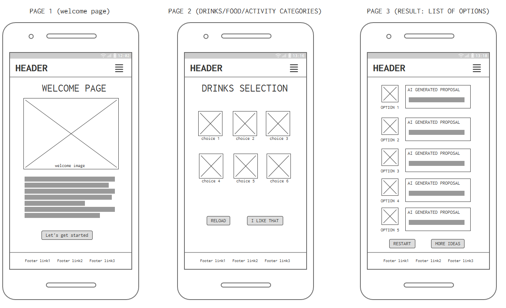

## DateSparkle


*DateSparkle* is a web application designed to help users plan memorable and romantic dates with their partners. Whether you're looking for a cozy dinner spot, an adventurous activity, or a relaxing getaway, DateSparkle has you covered.

### [Live View](https://datesparkle.netlify.app/)

## CONTENTS
t
* [User Experience (UX)](#User-Experience-UX)
  * [Our mission](#Our-mission)
  * [Responsivity](#responsivity)

* [Design](#Design)
  * [Color Scheme](#Color-Scheme)
  * [Wireframes](#Wireframes)

* [Features](#Features)

* [Development](#Development)
  * [Technologies Used](#Technologies-Used)
  * [Tools](#Tools)

* [Agile Development Process](#Agile-Development-Process)
  * [Moscow Prioritization](#Moscow-Prioritization)
    * [User Stories](#User-Stories)

* [Deployment](#Deployment)
 * [Deployment frontend](#Deployment-frontend)
 * [Deployment backend](#Deployment-backend)
   [Available endpoints](#Available-endpoints)
   * [API-deployment](#API-Deployment)

* [ Credits](#Credits)
 * [Code](#Code)
 * [Media](#Media)
 * [Acknowledgements](#Acknowledgements)


## USER EXPERIENCE
### Our Mission
At DateSparkle, our mission is to ignite sparks of joy and love by providing personalized and unique date ideas tailored to each individual's preferences. We believe that every couple deserves to experience magical moments together, and our platform strives to make that a reality. By combining technology with romance, we aim to inspire meaningful connections and create lasting memories.

### Responsivity

Two primary device views have been considered to ensure responsiveness for DateSparkle: mobile and larger monitor displays. While efforts have been made to enhance the application's mobile-friendliness, there's still room for improvement. Bootstrap features and custom CSS have been utilized as methods to achieve the desired level of device responsiveness.


## Design
### Color-scheme


The color palette was created using the [Adobe Color](https://color.adobe.com/create/image) website.

### Wireframes

We've used [Balsamiq](https://balsamiq.com/wireframes) to design our site wireframes for mobile and desktop.

<details>
<summary>DateSparkle wireframes</summary>

#### Desktop


#### Mobile


</details>


## Features
 - **Personalized Recommendations**: Get tailored suggestions based on your preferences for food, drinks, and activities.
 - **Location-Based Suggestions**: Access location-based recommendations using Google Places API for an enhanced experience.
 - **Interactive Interface**: User-friendly interface with checkboxes for easy selection of preferences.
 - **Random Prompt Generator**: Generate fun and creative date ideas with the click of a button.

## Development

### Technologies Used
   - HTML5
   - CSS3
   - JavaScript (ES6+)
   - Bootstrap
   - Django REST Framework
   - Google Places API
   - OpenAI API


### Tools

Here's a rundown of the key tools and platforms utilized in this project:

 - GitHub: Serves as the host for the website's source code. It also records the Agile development framework implementation, incorporating issues, milestones, and projects.
 - Heroku and Netlify: Used for deploying the live version of the website.
 - Balsamiq: Chosen for creating project wireframes.
 - [Am I Responsive?](http://ami.responsivedesign.is/) - to show the website image on a range of devices.
 - Google Fonts: Imports fonts to enhance the website's typography.
 - Font Awesome: Provides the necessary icons across the site.
 - Coolors: Provides the color palette across the site.


## Agile-Development-Process

The project's development was coordinated using GitHub's issues, milestones, and projects features. GitHub Projects served as an Agile tool, adapted effectively with appropriate tags and issue assignments.

This approach utilized user stories and a basic [Kanban board](https://github.com/users/DarrachBarneveld/projects/13). It helped us manage tasks, track progress, and smoothly move through development, testing, and completion phases.

### Moscow-Prioritization

|                  |       |      |      |
| ---------------- | ----- | ---- | ---- |
|  **Must Have** | *max 60% of stories* | guaranteed to be delivered | These are the core features that are vital for the initial release.|
|  **Should Have** | *aprox.20% of stories* | adds significant value, but not vital | These features are important and should be prioritized, but the project can proceed without them.|
|  **Could Have** | *20% of stories* | has small impact if left out | These features provide added value and are desirable, but they are not essential for the current release.|
|  **Won't Have** |  | not a priority | These are features that have been deliberately deferred to a later phase or release.|

### User-Stories

All user stories as part of a project: https://github.com/users/DarrachBarneveld/projects/13


## DEPLOYMENT

### Deployment frontend

**Getting Started with an npm Project**

To start an npm project, follow these steps:

1. Clone the Repository

Clone the repository to your local machine using the following command:

```
git clone https://github.com/DarrachBarneveld/cupidai.git

```

2. Install Dependencies

Navigate to the project directory and install the project dependencies using npm:

```
cd <project_directory> frontend
npm install

```

This command will install all the dependencies listed in the package.json file.

3. Start the Server

After installing the dependencies, start the server by running the following command:

```
npm start
```

This command will start the server and typically outputs the URL where the server is running. By default, it's usually localhost:1234.

4. Visit the Server URL

Open your web browser and navigate to the URL where the server is running, typically localhost:1234 unless specified otherwise.

You should now see the application running in your browser!

### Deployment backend
**DateSparkle API**

How to start

1. Make sure that [python](https://code.visualstudio.com/docs/python/python-tutorial#_install-a-python-interpreter) is installed in your system.
2. Install dependencies: \
   `pip install -r ./requirements.txt`
3. Create an env.py file with the following content:

   ```python
   import os
   
   os.environ["DEV"] = "True"
   os.environ["OPENAI_API_KEY"] = "your key here"
   os.environ["PLACES_API_KEY"] = "your key here"
   ```

4. Run the following command to start the server:\
   `python3 manage.py runserver`


### Available endpoints:

- AskGPT endpoint

  - **Method**: POST

  - **URL**: `/api/ask-gpt`

  - **Body**:
    ```json
    { "message": "your message here" }
    ```
  - **Response**:
   Responds with a stream of text. Can be read using *fetch* as in the following [article](https://developer.mozilla.org/en-US/docs/Web/API/Streams_API/Using_readable_streams#consuming_a_fetch_as_a_stream).

      Example of implementation can be seen below:

      ```javascript
      async function readData(url) {
         const response = await fetch(url);
         const reader = response.body.getReader();
         while (true) {
            const { done, value } = await reader.read();
            if (done) {
               // Do something with last chunk of data then exit reader
               return;
            }
            // Otherwise do something here to process current chunk
         }
      }
      ```

- Google Places endpoint

  - **Method**: POST

  - **URL**: `/api/places`

  - **Body**:
   ```json
   {
      "lat": 51.5072,
      "lng": 0.1276,
      "text": "music"
   }
    ```
  - **Response**:
   ```json
   {
      "places": [
         {
            "internationalPhoneNumber": "+44 7427 709209",
            "formattedAddress": "Unit 705, Exeter House, 41 Academy Way, Dagenham RM8 2FP, UK",
            "rating": 5,
            "googleMapsUri": "https://maps.google.com/?cid=9812856155803149089",
            "displayName": {
                "text": "M music for life",
                "languageCode": "en"
            },
         }
      ]
   }
   ```

### API Deployment
1. Add `gunicorn` to requirements.txt
2. Create a Procfile with the following content:
   ```
   web: gunicorn backend.wsgi
   ```
3. Create **Heroku** application and link to **GitHub** repository
4. Add custom [Build Pack](https://github.com/timanovsky/subdir-heroku-buildpack.git) to deploy from subdirectory. To add a custom Build Pack go to the Heroku settings to the Buildpacks section.
5. Setup environment variables:
   - `PROJECT_PATH` : `backend` - *the subdirectory where the api is located*
   - `DISABLE_COLLECTSTATIC` : `1`
   - `OPENAI_API_KEY` : *your secret key*
   - `PLACES_API_KEY` : *your secret key*

6. Deploy from branch


## Credits
### Code
While working on the project, we frequently referred to the following websites for troubleshooting:  

- [W3 Schools](https://www.w3schools.com)
- [Stack Overflow](https://stackoverflow.com)
- [MDN web docs](https://developer.mozilla.org)
- [Django Rest Framework documentation](https://www.django-rest-framework.org/)
- [Google for Developers](https://developers.google.com/maps/documentation/places/web-service/text-search)

- [Code Pen](https://codepen.io/puresick1/pen/popjyG)-for the loading heart
- [Code Pen](https://codepen.io/lisafolkerson/pen/BjRoJO)-for the floating heart
- [Code Pen](https://codepen.io/MarkBoots/pen/gOXEwpg)- how to list lets go button
- [Code Pen](https://codepen.io/mccombsc/pen/ZEzxWPy)- for the ring indicator

### Media
- openai.com
- unsplash.com
- canva.com 
- fontawesome.com
- color.adobe.com

### Acknowledgements
Thank you for the team effort to:
- [Darrach](https://github.com/DarrachBarneveld)
- [Camelia](https://www.linkedin.com/in/camelia-weber-0019091b4)
- [Erik](https://github.com/Erikas-Ramanauskas?tab=repositories)
- [Patricia](https://github.com/pswhdev)
- [Dimitri](https://github.com/dimitri-edel)
- [Angeliki](https://github.com/KikiBerg)
