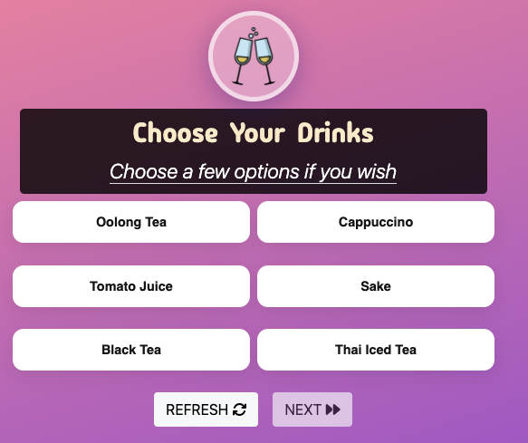
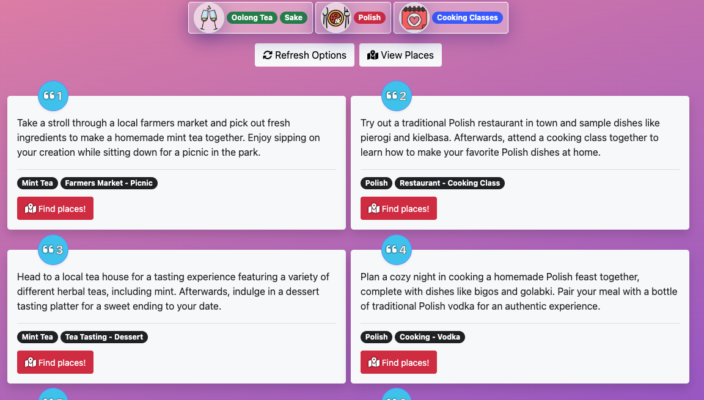
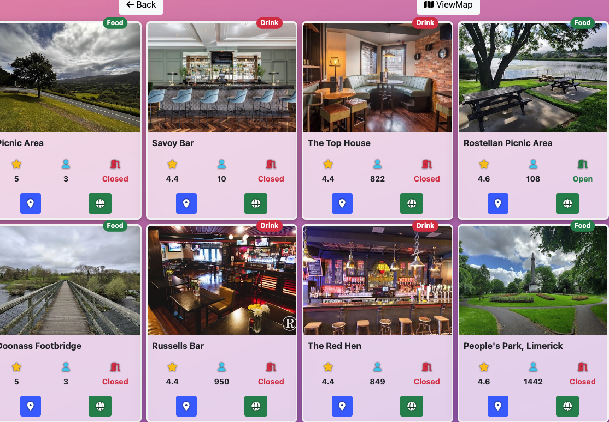
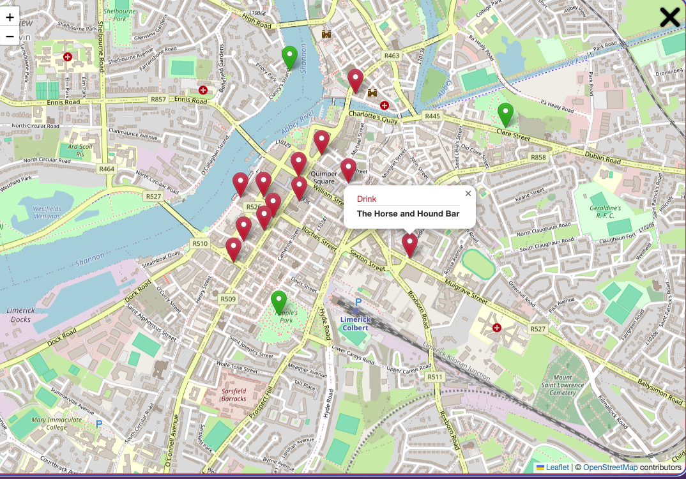

## Sparkle Ai


_Sparkle Ai_ is a web application designed to help users plan memorable and romantic dates with their partners. Whether you're looking for a cozy dinner spot, an adventurous activity, or a relaxing getaway, Sparkle Ai has you covered.

### [Live View](https://datesparkle.netlify.app/)

## CONTENTS

- [Our mission](#Our-mission)
- [Features](#Features)
- [Development](#Development)
  - [Technologies Used](#Technologies-Used)
  - [Agile Development Process](#Agile-Development-Process)
- [Deployment](#Deployment)
  - [Deployment frontend](#Deployment-frontend)
  - [Deployment backend](#Deployment-backend)
  - [Available endpoints](#Available-endpoints)
  - [API-deployment](#API-Deployment)
- [Credits](#Credits)
- [Acknowledgements](#Acknowledgements)

## USER EXPERIENCE

### Our Mission

At DateSparkle, our mission is to ignite sparks of joy and love by providing personalized and unique date ideas tailored to each individual's preferences. We believe that every couple deserves to experience magical moments together, and our platform strives to make that a reality. By combining technology with romance, we aim to inspire meaningful connections and create lasting memories.

## Features

- **Select Choices**: Choose from our database of hundreds of foods, drinks and activity options.
  
- **Personalized Recommendations**: Get tailored suggestions based on your preferences for food, drinks, and activities.
  
- **Location-Based Suggestions**: Access location-based recommendations using Google Places API for an enhanced experience. A brief overview of popularity, rating, location and the website of the local place are listed on the display card.
  
- **Quick Map**: Get a quick overview of the location of the date options with our custom map. Markers are colour coordianted to render the places category. For more detailed location services an external link to google maps uri is featured.
  

## Development

### Technologies Used

- React JS
- Bootstrap
- Django REST Framework
- Google Places API
- OpenAI API
- Leaflet

### Agile-Development-Process

The project's development was coordinated using GitHub's issues, milestones, and projects features. GitHub Projects served as an Agile tool, adapted effectively with appropriate tags and issue assignments.

## DEPLOYMENT

### Deployment frontend

**Getting Started with an npm Project**

To start an npm project, follow these steps:

1. Clone the Repository

Clone the repository to your local machine using the following command:

```
git clone https://github.com/DarrachBarneveld/cupidai.git

```

2. Install Dependencies

Navigate to the project directory and install the project dependencies using npm:

```
cd <project_directory> frontend
npm install

```

This command will install all the dependencies listed in the package.json file.

3. Start the Server

After installing the dependencies, start the server by running the following command:

```
npm start
```

This command will start the server and typically outputs the URL where the server is running. By default, it's usually localhost:1234.

4. Visit the Server URL

Open your web browser and navigate to the URL where the server is running, typically localhost:1234 unless specified otherwise.

You should now see the application running in your browser!

### Deployment backend

**DateSparkle API**

How to start

1. Make sure that [python](https://code.visualstudio.com/docs/python/python-tutorial#_install-a-python-interpreter) is installed in your system.
2. Install dependencies: \
   `pip install -r ./requirements.txt`
3. Create an env.py file with the following content:

   ```python
   import os

   os.environ["DEV"] = "True"
   os.environ["OPENAI_API_KEY"] = "your key here"
   os.environ["PLACES_API_KEY"] = "your key here"
   ```

4. Run the following command to start the server:\
   `python3 manage.py runserver`

### Available endpoints:

- AskGPT endpoint

  - **Method**: POST

  - **URL**: `/api/ask-gpt`

  - **Body**:
    ```json
    { "message": "your message here" }
    ```
  - **Response**:
    Example of implementation can be seen below:

    ```javascript
    try {
      const response = await fetch(`${API_URL}api/ask-gpt`, {
        method: "POST",
        headers: {
          "Content-Type": "application/json",
        },
        body: JSON.stringify({
          message: prompt,
        }),
      });

      if (!response.ok) {
        const errorData = await response.json();
        throw new Error(errorData.error);
      }

      const data = await response.json();
      return JSON.parse(data.message);
    } catch (error) {
      throw new Error(error.message);
    }
    ```

- Google Places endpoint

  - **Method**: POST

  - **URL**: `/api/places`

  - **Body**:

  ```json
  {
    "lat": 53.35014,
    "lng": -6.266155,
    "food": "italian",
    "drink": "bloody mary",
    "activties": "hiking, paintballing"
  }
  ```

  - **Response**:

  ```json
  {
    "drink": [
      {
        "formattedAddress": "153 Capel St, North City, Dublin, D01 V9V0, Ireland",
        "location": {
          "latitude": 53.3471139,
          "longitude": -6.268372200000001
        },
        "rating": 4.4,
        "googleMapsUri": "https://maps.google.com/?cid=919810580254921373",
        "websiteUri": "http://www.brotherhubbard.ie/",
        "regularOpeningHours": {},
        "userRatingCount": 3593,
        "displayName": {
          "text": "Brother Hubbard (North)",
          "languageCode": "en"
        },
        "photos": [],
        "category": "drink"
      }
    ],
    "food": [{}],
    "activity": [{}]
  }
  ```

### API Deployment

1. Add `gunicorn` to requirements.txt
2. Create a Procfile with the following content:
   ```
   web: gunicorn backend.wsgi
   ```
3. Create **Heroku** application and link to **GitHub** repository
4. Add custom [Build Pack](https://github.com/timanovsky/subdir-heroku-buildpack.git) to deploy from subdirectory. To add a custom Build Pack go to the Heroku settings to the Buildpacks section.
5. Setup environment variables:

   - `PROJECT_PATH` : `backend` - _the subdirectory where the api is located_
   - `DISABLE_COLLECTSTATIC` : `1`
   - `OPENAI_API_KEY` : _your secret key_
   - `PLACES_API_KEY` : _your secret key_

6. Deploy from branch

## Credits

### Code

While working on the project, we frequently referred to the following websites for troubleshooting:

- [Stack Overflow](https://stackoverflow.com)
- [MDN web docs](https://developer.mozilla.org)
- [Django Rest Framework documentation](https://www.django-rest-framework.org/)
- [Google for Developers](https://developers.google.com/maps/documentation/places/web-service/text-search)

### Acknowledgements

Thank you for the team effort to:

- [Darrach](https://github.com/DarrachBarneveld)
- [Camelia](https://www.linkedin.com/in/camelia-weber-0019091b4)
- [Erik](https://github.com/Erikas-Ramanauskas?tab=repositories)
- [Patricia](https://github.com/pswhdev)
- [Dimitri](https://github.com/dimitri-edel)
- [Angeliki](https://github.com/KikiBerg)
